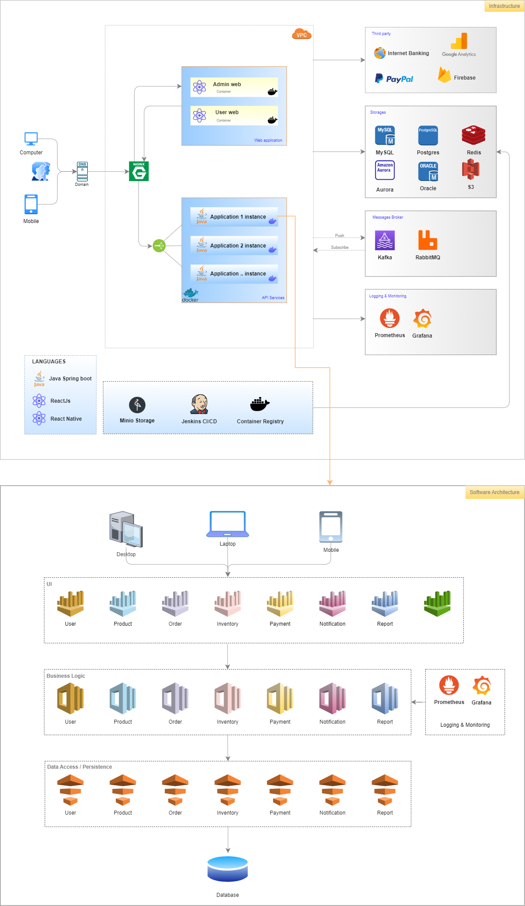

# SAMPLE APPLICATION


## I. Local Environment
### 1. Pre-Requisites
- Install JDK 8 or higher
- Install Maven 3.8.5 or higher
- Install Docker
- IntelliJ

### 2. Tech stack
- Java 8
- Spring boot 2.6.4
- Spring boot security
- Spring boot jwt
- Spring boot jpa
- Spring boot actuator
- Postgres
- Swagger 3.0
- Docker & Docker compose
- Grafana & Prometheus

### 3. Getting started
3.1 build project
```
$ mvn clean install
```
3.2 build docker images
```
$ docker-compose up -d --build
```
3.3 View API documents

Visit Swagger: [Swagger UI](http://localhost:8181/api/v1/swagger-ui.html)

3.4 Check Application Health

Visit [API-Service Health](http://localhost:8181/api/v1/actuator)

3.5 To update code and rerun
```
$ mvn clean install
$ docker-compose up -d --build
```

3.6 View application log
```
$ docker-compose logs -tf api-service
```

3.7 Remote Debug
- Connect port 5005
- Run Debug Mote

3.8 Log and Monitoring Application
- Monitoring and alert: [Prometheus Target](http://localhost:9090/targets)
- Prometheus web UI: [Prometheus Graph](http://localhost:9090/graph)
- Sign in grafana with account set in .env file: web UI: [Grafana](http://localhost:3000)
```
    GRAFANA_USER=admin
    GRAFANA_PASSWORD=password
```

***
# II. DEVELOP | Jenkins CI/CD
### Case 1: Build and run docker compose at local:
```
  $ mvn clean install
  $ docker-compose up -d --build
```
### Case 2: Build and push the image to a container registry and run images
- To provide DockerHub credentials to .m2/settings.xml with content as below:
```
<?xml version="1.0" encoding="UTF-8"?>
<settings xmlns="http://maven.apache.org/SETTINGS/1.2.0"
          xmlns:xsi="http://www.w3.org/2001/XMLSchema-instance"
          xsi:schemaLocation="http://maven.apache.org/SETTINGS/1.2.0 https://maven.apache.org/xsd/settings-1.2.0.xsd">
	<pluginGroups></pluginGroups>
	<proxies></proxies>
	<servers>
    <server>
      <id>registry.hub.docker.com</id>
      <username>luongquoctay87</username>
      <password>Hoilamj!123</password>
    </server>
	</servers>
	<mirrors>
	</mirrors>
	<profiles></profiles>
</settings>
```
- Build and push the images
```
  $ mvn compile jib:build
  $ docker-compose -f docker-compose.release.yml up -d
```

***
# III. UAT | DEPLOY
## 1. AWS Pre-Requisites
- EC2
- S3
- RDS (optional)

## 2. Installation EC2
### 2.1. Pre-Requisites
- Install JDK 8 or higher
- Install Maven 3.8.5 or higher
- Install Docker
- Set up environment

## 2.2. Installation
- Install docker
```
$ sudo su -
$ yum install -y docker
$ service docker start
$ systemctl enable docker
$ docker --version
```

- Install docker compose
```
$ curl -L "https://github.com/docker/compose/releases/download/1.29.2/docker-compose-$(uname -s)-$(uname -m)" -o /usr/local/bin/docker-compose
$ chmod +x /usr/local/bin/docker-compose
$ ln -s /usr/local/bin/docker-compose /usr/bin/docker-compose
$ docker-compose -v
```

- Set up system environment: copy all content `.env` file and paste to `.bash_profile`
  ```
   $ vi ~/.bash_profile
  ```
  ```
  GRAFANA_USER=admin
  GRAFANA_PASSWORD=password
  
  POSTGRES_URL=localhost
  POSTGRES_PORT=5432
  POSTGRES_DATABASE=postgres
  POSTGRES_USER=postgres
  POSTGRES_PASSWORD=password
  
  MAIL_HOST=smtp.gmail.com
  MAIL_PORT=587
  MAIL_USERNAME=crmsystem.sender@gmail.com
  MAIL_PASSWORD=mkwcalqvyssuszab
  
  ACCESS_KEY=XXX
  SECRET_KEY=YYY
  BUCKET_NAME=ZZZ
    ...
  ```

## 3. Run Application
Run application by docker with content as same as `docker-compose.release.yml` file